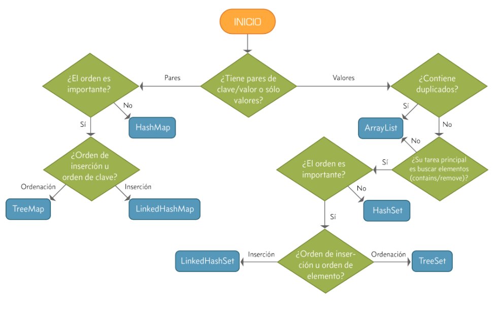
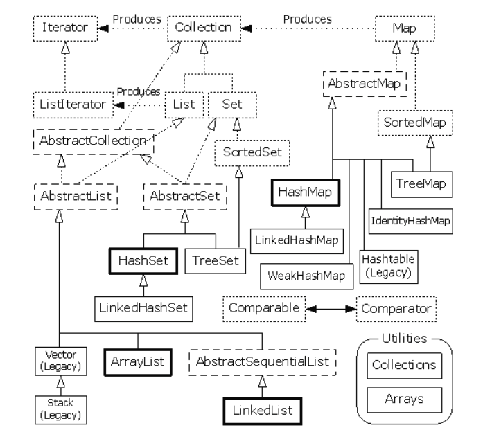
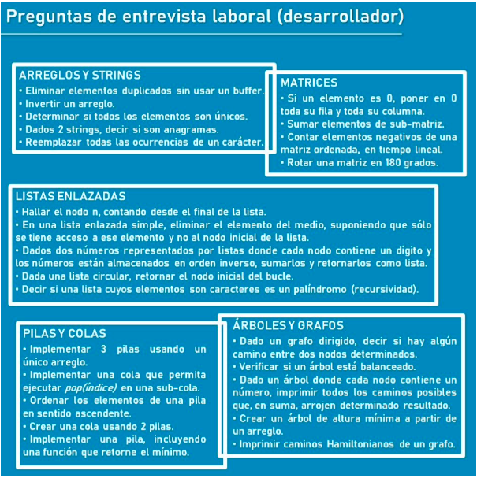

# Colecciones

## Concepto

* Representa un grupo de objetos (elementos)
* Es el almacén lógico donde guardar los elementos
* Son formas de organizar la información para manipular, buscar e insertar datos de manera eficiente

=== "java"

* En Java se emplea la interfaz genérica Collection.

  | Tipos (interfaces) | | Implementaciones |
  | -- | -- | -- |
  | **Set**  | colección que no puede contener elementos duplicados | HashSet, TreeSet, LinkedHashSet |
  | **List** | sucesión de elementos. Admite duplicados | ArrayList, LinkedList |
  | **Map**  | asocia claves a valores. No puede contener claves duplicadas y cada clave sólo puede tener asociado un valor | HashMap, TreeMap, LinkedHashMap |

  

  

  ```java
  // array redimensionable que aumenta su tamaño según crece la colección de elementos
  ArrayList<Integer> vector = new ArrayList<Integer>();
  vector.add(2);     // agrega 2 al final
  vector.add(1, 5);  // agrega 5 en la posición 1
  vector.set(0, 3);  // sustituye elemento que se encuentra en posición 0 por el objeto 3
  vector.get(1);     // devuelve elemento en la posición 1
  vector.remove(2);  // elimina elemento en la posición 2
  vector.toString(); // aplana a un string
  vector.isEmpty();  // verifica si esta vacio
  vector.indexOf(5); // devuelve posición del elemento 5, si no existe devuelve -1
  vector.size();     // devuelve tamaño del vector
  vector.contains(5);// verifica si está el elemento 5
  vector.clear();    // elimina todos los elementos

  // for
  for(int i = 0;  i < vector.size();  i++)
    vector.get(i);

  // for each
  for(Object objeto: vector)
    objeto

  // Iterator
  Iterator it = vector.iterator(); // se crea el iterador it para el array
  while(it.hasNext())              // mientras queden elementos
    it.next();                     // se obtienen

  for (Iterator it = vector.iterator(); it.hasNext();)
    it.next();

  // ----------------------------------------------------------------------

  // lista doblemente enlazada de los elementos
  List<Integer> lista = new LinkedList<Integer>();
  lista.add(2);
  lista.add(1, 5);
  lista.add(3);
  lista.remove(1);
  lista.toString();
  lista.isEmpty();
  lista.get(1);
  lista.size();

  // ----------------------------------------------------------------------

  // LIFO (Last In First Out)
  Stack<Integer> pila = new Stack<Integer>();
  pila.push(2);
  pila.push(5);
  pila.push(3);
  pila.pop();
  pila.toString();
  pila.empty();
  pila.peek();     // elemento en el tope

  // ----------------------------------------------------------------------

  // almacena claves en una tabla hash
  HashMap<String, Object> map = new HashMap<String, Object>();
  map.put("user", "ppando");
  map.get("user");

  // ----------------------------------------------------------------------

  // útil para almacenar y recuperar archivos de propiedades
  Properties prop = new Properties();
  prop.put("user", "ppando");
  prop.get("user");
  prop.load(new FileInputStream(new File("/prop.properties")));
  ```

=== "python"

```py
# puede guardar distintos tipos de valores
# se pueden expandir dinámicamente, agregando nuevos elementos
lista_vacia = []
lista = ['Maria', 'Pepe', 'Marta', 'Antonio']
lista_lista = [1, [2, 3], 4]

# list(c): crea una lista con los elementos de la secuencia o colección c.
print(list())
print(list((1, 2, 3)))
print(list('python'))

lista[:]   # Toda la lista
lista[2]   # Marta
lista[7]   # IndexError: list index out of range
lista[-2]  # Marta
lista[0:3] # ['Maria', 'Pepe', 'Marta']
lista[1:]  # ['Pepe', 'Marta', 'Antonio']
lista[:2]  # ['Maria', 'Pepe']

# operaciones que no modifican la lista
len(lista) # 4
min(lista)
max(lista)
sum(lista)
lista.index('Antonio')  # 3
lista.count('Antonio')  # 1
'Pepe' in lista         # True
'Juan' in lista         # False

# Operaciones que modifican la lista
lista.append('Ana')             # agrega al final
lista.insert(2, 'Ana')          # agrega en índice 2
lista.extend(['Luis', 'Pablo']) # une listas al final
lista.remove('Ana')
lista.pop()                     # elimina último elemento
lista.sort()
lista.reverse()

# Listas por comprensión
lista = [1, 2, 3, 4, 5, 6]
[x*2 for x in lista if x > 2]

# -----------------------------------------------------------------------

# listas inmutables
# ventajas: + rápidas en cuanto a ejecución y - espacio (mayor optimización)
tupla_vacia = ()
tupla = ('Juan', 13, 1, 1995)
tupla_tupla = ((1, 2, 3), (4, 5, 6))

# tuple(c): crea una tupla con los elementos de la secuencia o colección c.
print(tuple())
print(tuple([1, 2, 3]))
print(tuple('python'))

tupla[1]             # 13
len(tupla)           # 4
tupla.count(9)       # 1
tupla.index('Juan')  # 0
'Juan' in tupla      # True

list(tupla)          # Convierte tupla en lista
tuple([1, 2])        # Convierte lista en tupla

nom, dd, mm, yyyy = tupla # desempaquetado de tupla
print(nom)                # 'Juan'

# -----------------------------------------------------------------------

# asociación de tipo clave : valor
# los elementos almacenados no están ordenados.
dicc_vacio = {}
dicc = {'Arg':'Bs As', 'Chile':'Santiago', 'Brasil':'Brasilia'}
dicc_dicc = {'nom_full': {'nom': 'pp', 'ape': 'perez'}, 'edad': 45}

# Acceso a valores
dicc['Brasil']          # 'Brasilia'
dicc.get('Brasil')      # 'Brasilia'

# Operaciones que no modifican a un diccionario
len(dicc)     # 3
min(dicc)
max(dicc)
sum(dicc)

'España' in dicc  # False
dicc.keys()       # ['Arg', 'Chile', 'Brasil']
dicc.values()     # ['Bs As', 'Santiago', 'Brasilia']
dicc.items()

# Operaciones que modifican a un diccionario
dicc['Arg'] = 'Buenos Aires'            # agregar elemento
dicc.update({'Uruguay': 'Montevideo'})  # actualiza
dicc.pop('Uruguay')                     # elimina elemento
dicc.clear()
```

## Ejercicios

1. En una terminal de teletipo existe un carácter de retroceso que permite cancelar el último carácter. Por ejemplo: si el carácter de retroceso es /, entonces la línea abc/d//e será interpretada como ae. Existe también un carácter anulador que elimina todos los caracteres ingresados hasta el momento, suponga que ese carácter es &. Realice un método que dada una tira de caracteres terminadas con * (leída del archivo “Fuente.txt”) ejecute las operaciones indicadas si se encuentra con el carácter / o el &. Debe por último imprimir la tira resultante.

1. En un supermercado se mantiene una cola A con diversos clientes de los que se conoce número de ubicación en la cola y cantidad de productos que lleva. Se abre una nueva cola B para clientes que llevan menos de 5 productos. Usted debe dejar en la cola A los clientes que llevan más de 5 o hasta 5 productos en el orden en que estaban, y en la cola B los que compran menos de 5 artículos, respetando el orden que tenían en la cola A. En ambas colas reasignar un nuevo número de ubicación.

1. Se tiene ordenada por código de producto, una lista donde cada Producto, tiene como atributos código,  descripción, importe y  stock. Implementar métodos para:
    1. Imprimir la lista completa.
    1. Dado un entero k, imprimir el k-ésimo elemento.
    1. Incrementar el importe de un producto dado en un 10%.
    1. Devolver el stock de un producto dado o cero si no esta.
    1. Devolver una lista de productos con stock inferior a 50 unidades.
    1. Devolver una lista de productos con stock superior o igual a 50 unidades.

1. Diseñe e implemente un juego de memoria donde la idea es para un nivel inicial encontrar los pares de coincidencias.
    * La solución debe contemplar varios niveles de dificultad, para ello debe disponer de una colección de tableros, modelizados a través de una jerarquía.
    * La clase abstracta Tablero debe incluir métodos para inicializar el tablero y para indicar las selecciones sucesivas del usuario.
    * Para la entrega del ejercicio, debe implementar un tablero de 6x6 celdas que contengan números dispuestos aleatoriamente.
    * Cuando el usuario escoge una celda se visualiza el número que contiene la misma, si la segunda selección resulta en coincidencia entonces ambas celdas desaparecen, sino ambas ocultan nuevamente el número que contienen.
    * Durante el juego además del tablero se debe mostrar la cantidad de selecciones que realiza el usuario.

1. Se ingresa por teclado un conjunto de valores enteros, El ingreso de datos finalizará cuando ingrese el valor 0 (cero). Luego se ingresa otro conjunto de valores enteros y, por cada uno de estos, se debe informar si el valor ingresado pertenece o no al primer conjunto.

1. Utilizando la función eliminar, se pide ingresar dos conjuntos A y B para mostrar el contenido resultante C = A – B.

1. Se ingresa por teclado un conjunto de valores que finaliza con la llegada de un 0 (cero). Se pide mostrar los elementos del conjunto en orden inverso al original. Usar pila.

1. Se debe procesar un archivo que contiene información sobre los siniestros denunciados por los clientes de una compañía de seguros En el archivo existe un registro por cada denuncia, con los siguientes campos:
    * Número de matrícula (6 caracteres).
    * Fecha (10 caracteres, con formato “dd/mm/aaaa”).
    * Detalles (256 caracteres).
    * No se conoce cuántas matrículas diferentes existen ni tampoco la cantidad máxima de siniestros denunciados que puede haber por cada una de ellas. Los registros en el archivo están ordenados ascendentemente por fecha.
    * Se pide emitir un listado ordenado por número de matrícula informando, por cada una, la fecha y el detalle de cada uno de los siniestros denunciados.

1. Para analizar el rendimiento de sus empleados, una empresa decide llevar el registro de las actividades que cada uno desarrolla durante su tiempo de trabajo. En la empresa trabajan hasta 50 empleados (numerados de 0 a 49) y existen hasta 200 proyectos (numerados de 0 a 199). Al finalizar la jornada laboral, cada empleado completa uno o varios registros en el archivo HORAS.dat cuya estructura es la siguiente:
    * Número de empleado.
    * Número de proyecto.
    * Cantidad de horas.
    * Descripción de la tarea realizada.
    * Fecha de la tarea.
    * El archivo se encuentra ordenado naturalmente, es decir, por fecha ascendente. Se pide generar un listado que informe por cada empleado el detalle de las tareas realizadas en cada uno de los proyectos en los que participó. El listado debe estar ordenado por número de empleado, luego por número de proyecto y, finalmente, por fecha descendente, es decir, primero las tareas más recientes.

1. Supongamos que nos piden desarrollar un sistema para administrar la entrega de platos y bebidas en las diferentes mesas de un restaurante. Cada mesa se identifica con un número entero (el número de mesa) y cada plato o bebida se identifica con un código numérico entero (el código del plato o bebida). Durante su permanencia los comensales solicitan al mozo que les sirva diferentes cantidades de platos y bebidas. Luego, al finalizar el almuerzo o la cena, le solicitarán la cuenta, que consiste en un detalle de lo que han consumido y el importe total que deben pagar.

1. Una biblioteca desea sistematizar sus sistema de préstamos a sus asociados. Tener en cuenta que la biblioteca maneja libros, revistas nacionales, revistas importadas y periódicos. Los préstamos se efectúan únicamente a socios que tengan su cuota actualizada y que no estén suspendidos. El lapso de préstamo es de 15 días. Ningún socio puede tener más de tres libros en su poder al mismo tiempo. Las demoras en la devolución de libros se castigan con un lapso de suspensión igual al lapso de la demora. Si un libro pedido no está disponible el socio puede quedar en una cola de reservas. Un libro reservado sólo puede prestarse al primer socio en su cola de reservas. La biblioteca espera obtener información estadística de las preferencias de sus asociados. Diseñe el conjunto de clases necesarias para modelar el sistema.


