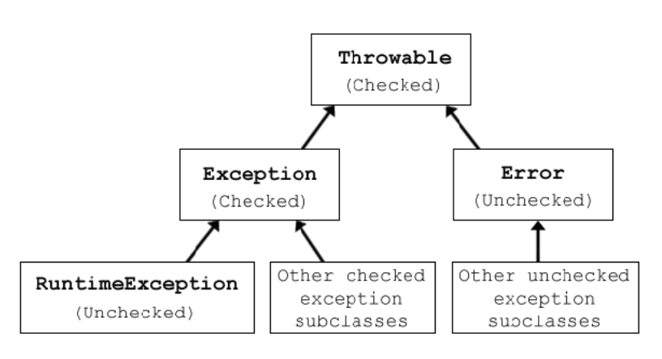
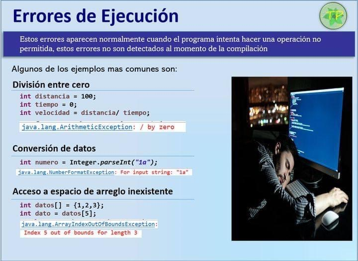

# Excepciones

* Representan condiciones excepcionales que el programador quiere tratar (controlar)
* Aparecen cuando el programa intenta hacer una operación no permitida
* Errores no detectados al momento de la compilación, si en tiempo de ejecución
* Usuarios esperan que el programa se comporte de forma sensata cuando se producen errores -> volver a un estado seguro

| Tipo | Clase Java | Clase Python |
| -- | -- | -- |
| División entre cero | **ArithmeticException**   | **ZeroDivisionError** |
| Conversión de datos | **NumberFormatException** | **TypeError**         |
| Archivo incorrecto  | **IOException**           | **FileNotFoundError** |
| Acceso a espacio de arreglo inexistente | **ArrayIndexOutOfBoundsException** | **IndexError**  |
| null.método()                           | **NullPointerException**           | **ValueError**  |
| Refundiciones incorrectas               | **ClassCastException**             | |
| Acceso a dict con key inexistente       |                                    | **KeyError**    |
| Falla importación módulo                |                                    | **ImportError** |

## Clasificación de Excepciones

=== "java"

  

  | Clase | | ¿Recuperable? |
  | -- | -- | -- |
  | **Exception** | se produce porque se ha cometido un error de programación | SI |
  | **Error**     | describe errores internos y el agotamiento de recursos    | NO |

  | Tipos de exceptions | | Ejemplos |
  | -- | -- | -- |
  | **Comprobadas** | compilador verifica que el programador proporcione, o bien, un manejador o que lance la excepción | IOException, FileNotFoundException, SQLException, ... |
  | **No Comprobadas** | excepciones comunes que no se comprueban | Error y sus subclases (OutOfMemoryError, InternalError, ...) y RuntimeException y sus subclases (NullPointerException, ArrayIndexOutOfBoundException, NumberFormatException, ClassCastException, ArithmeticException, ...) |

  

## Declaración

* Para crear excepciones propias generalmente se hace una subclase de Exception

=== "java"

  ```java
  public class NombreException extends Exception { }
  ```

=== "python"

  ```py
  class NombreException(Exception):
    pass
  ```

## ¿Cómo se causan excepciones?

* Implícitamente: el programa hace algo ilegal
* Explícitamente: ejecución de la sentencia throw

=== "java"

  ```java
  public class SinNaftaException extends Exception { }

  public class Auto {
    
    public void arrancar() {
      if (nafta < 0.1)
        throw new SinNaftaException();
      ...
    }

  }  
  ```

=== "python"

  ```py
  class SinNaftaException(Exception):
    pass

  class Auto:

    def arrancar(self):
      if self.nafta < 0.1:
        raise SinNaftaException()
  ```

## ¿Cómo manejar una excepción?

=== "java"

```java
public double divide(double op1, dpuble op2) {
  try {
    // código que levanta la excepción
    return op1 / op2;
  } catch (ArithmeticException ex) {
    // código que se ejecuta en caso de excepción
    System.out.println("No se puede dividir por cero");
    return 0;
  }
}
```

=== "python"

  ```py
  def divide(n1, n2):
    try:
      return n1 / n2
    except ZeroDivisionError:
      print('No se puede dividir por cero')
      return 'operación errónea'
  ```

## ¿Cómo manejar múltiples excepciones?

=== "java"

  ```java
  public void divide() {
    try {
      Scanner in = new Scanner(System.in);
      double op1 = in.nextDouble();
      double op2 = in.nextDouble();
      in.close();
      System.out.println("La división es " + op1 / op2);
    } catch (NumberFormatException ex1) {
      System.out.println("Valores incorrectos");
    } catch (ArithmeticException ex) {
      System.out.println("No se puede dividir por cero");
    }
    System.out.println("Cálculo finalizado");
  }
  // en aumento a Exception (de lo particular a lo general); al revés no compila
  ```

=== "python"

  ```py
  def divide():
    try:
      op1 = int(input('Num 1: '))
      op2 = int(input('Num 2: '))
      print('La división es ' + str(op1 / op2))
    except ValueError:
      print('Valores incorrectos')
    except ZeroDivisionError:
      print('No se puede dividir entre cero')
    print('Cálculo finalizado')
  ```

## Comportamiento de tipo reanudación

=== "java"

  ```java
  double op1 = 0;
  double op2 = 0;
  while (true) {
    try {
      Scanner in = new Scanner(System.in);
      System.out.print("Num 1: ");
      op1 = in.nextDouble();
      System.out.print("Num 2: ");
      op2 = in.nextDouble();
      in.close();
      break;
    } catch (NumberFormatException e) {
      System.out.println("Valores incorrectos. Intente nuevamente");
    }
    System.out.println(divide(op1, op2));
  }
  ```

=== "python"

  ```py
  while True:
    try:
      n1 = int(input('Num 1: '))
      n2 = int(input('Num 2: '))
      break
    except ValueError:
      print('Valores incorrectos. Intente nuevamente')
  print(divide(n1, n2))    
  ```

## Sobre el uso de excepciones

* Una condición de error es tratada sólo donde tiene sentido hacerlo y no en todo el nivel entre que ocurre y es tratada
* El código puede ser escrito como si todas las operaciones funcionaran correctamente
* Deben ser tratadas lo más específicamente posible
* No se deben dejar vacíos o solo imprimiendo el stack trace los bloques catch
* Stack Trace (Seguimiento de Pila): listado de todas las llamadas a métodos pendientes en un determinado momento de la ejecución de un programa

## Ejercicios

1. Cree una clase con un método main() que genere un objeto de la clase Exception dentro de un bloque try. Proporcione al constructor de Exception un argumento String. Capture la excepción dentro de una cláusula catch e imprima el argumento String. Añada una cláusula finally e imprima un mensaje para demostrar que pasó por allí.

1. Defina una referencia a un objeto e inicializela a null. Trate de invocar un método a través de esta referencia. Ahora rodee el código con una cláusula try-catch para probar la nueva excepción.

1. Escriba código para generar y capturar una excepción ArrayIndexOutOfBoundsException (Índice de matriz fuera de límites).

1. Cree su propia clase de excepción utilizando la palabra clave extends. Escriba un constructor para dicha clase que tome un argumento String y lo almacene dentro del objeto como una referencia de tipo String. Escriba un método que muestre la cadena de caracteres almacenada. Cree una cláusula try-catch para probar la nueva excepción.

1. Defina un comportamiento de tipo reanudación utilizando un bucle while que se repita hasta que se deje de generar una excepción.

1. Un banco contiene las Cuentas de sus clientes. Las cuentas de ahorro no pueden tener números rojos. Las cuentas corrientes pueden tener una cuenta de ahorro asociada, de forma que si se intenta retirar más dinero del saldo actual, se debe retirar el dinero que falte de la cuenta de ahorro asociada.
    1. Define Cuenta de forma que no pueda instanciarse. De toda Cuenta se debe poder ingresar y retirar dinero, preguntar por el saldo, por el DNI del titular y debe tener un método toString de devuelva al menos el saldo y el DNI del titular.
    1. Implementa las clases CuentaCorriente y CuentaDeAhorro.
    1. Crea una especialización CuentaDeAhorroEsp de CuentaDeAhorro en la que se añade un entero penalización, de forma que se penaliza la retirada con una penalización % del dinero retirado. Sobrescribe sólo los métodos necesarios (incluyendo constructor y toString).
    1. Si el saldo de CuentaDeAhorro fuese a quedar negativo, antes de debe lanzar una excepción SaldoNegativo (que hereda de Exception).
    1. Implementa la clase Banco que contiene una colección de Cuentas, incluyendo el constructor que consideres más apropiado.
    1. Incluye el método totalSaldoMaxPenalización en la clase Banco que devuelva la suma de los saldos de todas las cuentas corrientes y la máxima penalización entre las CuentaDeAhorroEsp.
    1. Crea una clase con método main en la que instanciamos un Banco de 100 Cuentas, nos creamos una CuentaCorriente con 5000 pesos y una cuenta de ahorro especial con una penalización del 5%. Finalmente debe mostrar información de todas las Cuentas del Banco. En un bloque try & catch retirar dinero de una Cuenta de Ahorro.
