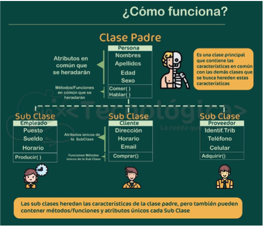
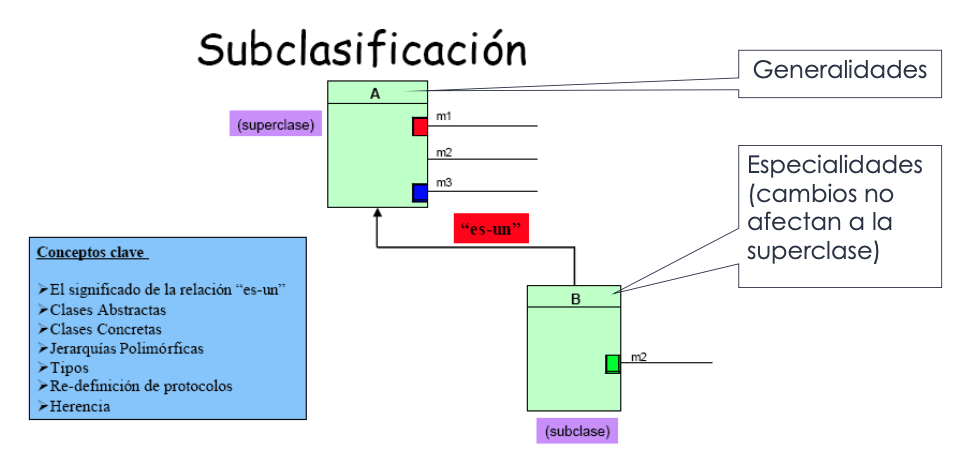

# Herencia

* Usamos las clases para representar parte del conocimiento que adquirimos del dominio de problema.
* ¿Qué sucede cuando las clases comparten parte del conocimiento que representan?
  * Subclasificación.
* Crear clases nuevas que se construyan tomando como base clases ya existentes.
* Cuando se hereda, se reutilizan métodos y atributos.
* Permite extender la funcionalidad de un objeto.
* Tipos:
  * **Simple**:
    * Una clase puede heredar de una única clase.
    * Ejemplo: Circulo es una Figura, Mamífero es un Animal, Punto3D es un Punto, etc.
    * LP: Java, C#
  * **Múltiple**:
    * Una clase puede heredar de varias clases.
    * Ejemplo: Alumno es una Persona y es un Hijo, Omnívoro es una Herbívoro y es un Carnívoro, etc.
    * LP: Python, Eiffel, C++






## Constructores

* Los constructores NO se heredan de las superclases.
* Si se puede invocar del constructor de la subclase a la superclase con super().
* Debe ser primera sentencia del cuerpo del constructor.

```java
public class CajaDeAhorro extends CuentaBancaria {

  public CajaDeAhorro() {
    super();
  }

}
```

## Métodos

* Si heredo métodos que no tienen sentido en la subclase, la jerarquía fue forzada -> MAL DISEÑO.
* Si heredo métodos que son insuficientes en la subclase -> OVERWRITING.
* La sobreescritura puede ser PARCIAL o TOTAL.
* Para sobrescribir un método se debe respetar la signatura del mismo.
* Ejemplo:

```java
public boolean equals(Object obj) {
  ...
}
```

## Ejercicios

1. Existen dos tipos de vehículos: las motocicletas, que llevan un chofer y un acompañante, y los autobuses, que llevan un chofer y varios pasajeros. Los vehículos deben conocer la cantidad de kilómetros recorridos, asignar y cambiar chofer. Cada vehículo particular deberá poder agregar un acompañante o diversos pasajeros, respectivamente. En caso del Autobús, no puede cambiar de chofer si hubiera pasajeros. En el caso de la Motocicleta, no puede hacerlo si hubiera un acompañante.

1. Modele una Empresa con empleados. Una empresa conoce a todos sus empleados. Los empleados pueden ser de planta permanente o temporaria, además hay gerentes, que también son empleados de planta permanente, pero siguen un régimen salarial particular. Cuando un empleado es de planta permanente cobra la cantidad de horas trabajadas por $300, más antigüedad ($100 por año de antigüedad), más salario familiar. Cuando es de planta temporaria, no cobra antigüedad y cobra la cantidad de horas trabajadas por $200, más salario familiar. El salario familiar es $200 por cada hijo, los empleados casados además cobran $100 por su esposa/o. Un gerente cobra de manera similar a un empleado de planta permanente pero su hora trabajada vale $400, por antigüedad se le pagan $150 por año, mientras que el salario familiar es el mismo que el de los empleados de planta permanente y temporal. Defina e implemente el mensaje montoTotal() en la clase Empresa, que retorna el monto total que la empresa debe pagar en concepto de sueldos a sus empleados. Provea una clase TestEmpresa para instanciar y testear su sistema. En el método main de esa clase cree el siguiente escenario y envíe a la empresa el mensaje montoTotal() para obtener la liquidación total:
    * Una empresa, con el CUIT y Razón Social que desee, y con los cuatro empleados que se describen a continuación:
    * Un empleado de Planta Temporaria con 80 horas trabajadas, con esposa y sin hijos.
    * Un empleado de Planta Permanente (que no sea gerente) con 80 horas trabajadas, con esposa, 2 hijos y 6 años de antigüedad.
    * Un empleado de Planta Permanente (que no sea gerente) con 160 horas trabajadas, sin esposa, sin hijos y con 4 años de antigüedad.
    * Un Gerente con 160 horas trabajadas, con esposa, un hijo y 10 años de antigüedad.

1. En este ejercicio se pretende construir una pequeña base de datos de canciones clásicas en CD.
Para ello se debe definir una clase base Canción, de la cual descenderán todas las demás (clásica, pop, jazz, etc.). Nosotros solo implementaremos la clase Clásica. La clase abstracta Canción tendrá 4 atributos: número de referencia (long), el cual identifica el CD de música, único para cada CD. Titulo (string), nombre de la canción. Álbum (String), nombre del disco. Grupo (String), nombre del grupo que toca la canción y el método abstract imprimirCancion();. La clase Clásica hereda de Canción. Esta clase tendrá solo una variable adicional: Instrumentos(String), que pondrá el tipo de instrumentos que se usan.
El programa principal deberá permitir elegir distintas opciones:
    * crear: permite agregar una nueva canción.
    * eliminar: borrar una canción, dado su número de referencia.
    * listado: mostrar todas las canciones de la base de datos.
    * salir: fin del programa.
