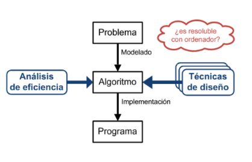
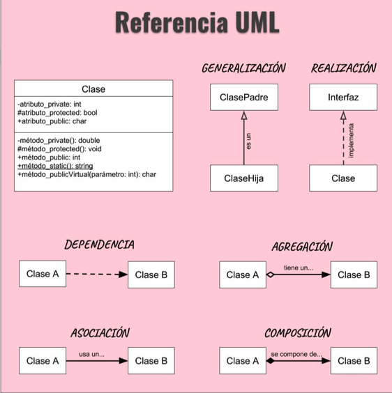
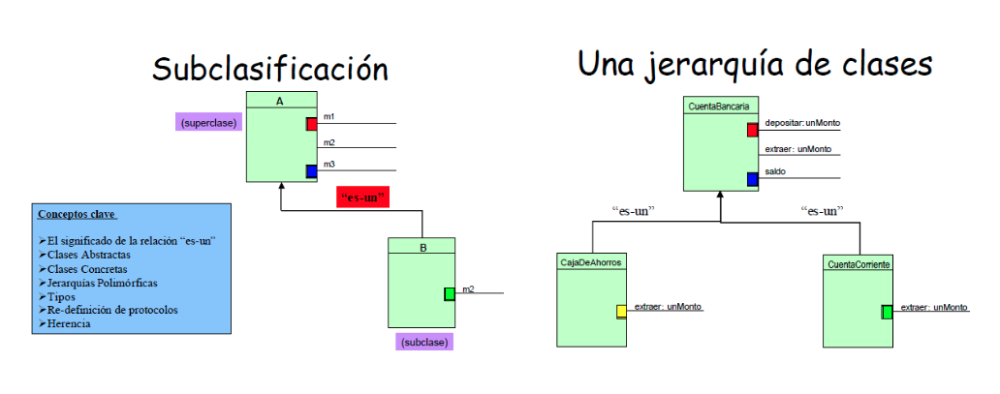

# Introducción al POO

## ¿Qué es programación?

* Es una habilidad que se adquiere mejor con la **práctica** y el **ejemplo** más que con los libros (Alan Turing)

## ¿Cuáles son las ramas de la programación?

## ¿Qué hace un programador?

* Crear soluciones tecnológicas que satisfagan las necesidades de los usuarios.

1. **Diseñar**: el código necesita una estructura ordenada que asegure su funcionamiento.
1. **Testear**: se prueba el software en busca de posibles errores de funcionamiento.
1. **Depurar**: diagnóstico y arreglo de errores.

* Se espera un código:
  * Eficiente
  * Robusto
  * Legible
  * Confiable

## ¿Cuáles son los niveles de los desarrolladores?

* **Junior**: necesita supervisión
* **Semi Senior**: capacidad. técnica de realizar tareas con menos supervisión.
* **Senior**: es capaz de supervisar y dirigir equipos.

## ¿Cómo se aprende a programar?

* Se aprende a programar en la **Universidad**.
* Es necesario ser **autodidactas**, ya que las tecnologías evolucionan muy rápido.
* Las empresas contratan basandose con **habilidades comprobadas**.

## ¿Qué es un algoritmo?

* Es la secuencia de pasos que resuelven un programa y es la base de la programación.
* Las partes de un algoritmo son:
  * **Entrada**: datos
  * **Proceso**: operaciones con los datos
  * **Salida**: resultado
* Características:
  * **Preciso**: resolver el problema sin errores.
  * **Definido**: si se ejecuta el algoritmo varias veces, la salida serán iguales en cada repetición.
  * **Finito**: debe tener un inicio y un final.
  * **Legible**: cualquier persona que vea el algoritmo debe ser capaz de comprenderlo.
* Representación:
  * Gráfica: **Diagrama de Flujo**
  * No gráfica: **Pseudocódigo**

## ¿Cómo se desarrolla un algoritmo?

1. Obtener una descripción clara (sin ambiguedades, asunciones, contradicciones) del problema.
1. Analizar el problema (datos, reglas)
1. Diseñar el algoritmo (técnicas)
1. Desarrollar el algoritmo a alto nivel.
1. Refinar el algoritmo agregando detalles.
1. Revisar el algoritmo (determinar si resuelve el problema)

## ¿Cómo se resuelve un problema?

1. **Diseñar** un algoritmo para el problema.
2. Expresar el algoritmo como un **Programa** (especificación formal de un algoritmo por medio de un lenguaje de programación)
3. **Ejecutar** el programa (Eficiencia + V&V)

## ¿Cuáles son los entornos de trabajo en el desarrollo de software?

1. **Desarrollo local**: lo que el programador ve en un su computadora.
1. **Entorno de pruebas**: los tester prueban el producto para encontrar o reportar fallas.
1. **Staging**: características del entorno de producción, se hacen pruebas de confiabilidad (aceptación)
1. **Entorno de producción**

## ¿Qué son los paradigmas de programación?

* Son los diferentes estilos de usar la programación para resolver un problema.
* Es un modelo que brinda reglas que permiten abstraer la realidad.
* Tipos:
  * Operacionales (COMO)
    * Imperativo: secuencia, ciclos y condiciones. Mutación de variables. Lenguajes: Fortran, C, Pascal, COBOL
    * Orientado a Objetos: Objetos que tiene datos y comportamiento y se comunican enviándose mensajes. Lenguajes: Java, Python, Eiffel, Smalltack
  * Declarativos (QUE)
    * Funcional: funciones que no manejan datos mutables o estados. Lenguajes: Lisp, Haskell
    * Lógico: reglas y hechos basados en la lógica de predicado. Lenguajes: Prolog y dialectos.

## ¿Qué es la POO?

* Es una forma de programar, más cercana a como expresaríamos las cosas en la vida real que otros tipos de programación (alto nivel)
* Se escriben programas en términos de: clases, objetos, encapsulamiento, propiedades, herencia, polimorfimo.
* Todo es pensado como un objeto.
* Los objetos que existen en el mundo real pueden ser conceptuales (Ej. pedido, plano, punto, caja de ahorro) o físicos (Ej. vehículo).

## ¿Qué es un POO?

* Es un conjunto de objetos que se comunican entre sí, enviándose mensajes para resolver un problema.

## ¿Cual es el ciclo de vida del objeto?

1. **Creación**: CA ca1 = new CA()
2. **Uso**: ca1.getSaldo()
3. **Destrucción**: ca1 fuera de su scope. Garbagge Collector.

## ¿Cuáles son las características del POO?

* **Encapsulamiento**: ocultar detalles de implementación.
* **Polimorfismo**: objetos responden al mismo mensaje (mismo comportamiento)
* **Clase**: describir la estructura del objeto, responsable de crear sus instancias.
* **Herencia**: compartir conocimiento. Se dá en una jerarquía (clasificación)

## ¿Cuáles son las relaciones entre las clases?

* **Dependencia** (Colaboradores Externos) -> "utiliza un"
  * Pedido utiliza la clase Cuenta.
* **Composición** (Colaboradores Internos) / **Agregación** -> "tiene un"
  * Pedido contiene objetos de tipo Artículo.
* **Herencia** (Compartir conocimiento) -> "es un"
  * PedidoVigente es un Pedido.

## Ejemplo de jerarquía de clases

## ¿Qué es un lenguaje de programación?

* Es una notación para escribir programas.
* Proporcionan estructuras:
  * **sintácticas**: cómo escribir una expresión
  * **semánticas**: cómo evaluar una expresión

## ¿Cuáles son las características de un LOO?

* Todo es un objeto.
* Todo objeto es instancia de una clase.
* Todos los objetos de la misma clase pueden recibir los mismos   mensajes.
* Las clases se organizan en una estructura arbórea de raíz única, llamada jerarquía de herencia.

## Genealogía de los LOO

* A partir de los ‘90 proliferan con gran éxito la tecnología y LOO.
* En 1995. Java. James Gosling de Sun Microsystems. "write once, run anywhere"
* Los más implantados en la actualidad: Java, C++ y PHP.
* C#, Python, Ruby, Delphi son otros LOO muy utilizados.

## Actividad

1. Identificar objetos y responsabilidades: Supongamos que Luis quiere enviar flores a Alba, que vive en otra ciudad. Luis va a la floristería más cercana, regentada por un florista llamado Pedro. Luis le dice a Pedro que tipo de flores enviar a Alba y la dirección de recepción.

1. Identificar objetos y responsabilidades: Gestionar para un edificio la simulación del desplazamiento de su ascensor que puede viajar desde el piso 1 hasta el piso final que se indique (no puede bajar menos del piso 1 y no puede subir más del piso final). Cuenta con una limitación de peso de 750Kg. Para realizar el desplazamiento hay que indicar la cantidad de personas que se suben y el piso destino. La cantidad de personas se usa para calcular el peso a desplazar (considerando que cada persona pesa 50 kg).
